# LinuxReflect

**Disk imaging, file backup and bare-metal recovery for Linux, with a
Macrium Reflect–style GUI.**

LinuxReflect images whole disks and partitions, backs up folders, keeps
full/incremental/differential chains, encrypts and verifies them, restores
them onto the same or a new disk, and boots a rescue medium when the machine
itself no longer does. A root daemon does the work; the GUI, the CLI and the
desktop notifier are unprivileged clients authorised through polkit.

[](https://github.com/woffko/linuxreflect/releases)
[](#license)

> **Alpha.** `v0.1.0-alpha.1` is the first public build. Backups read your
> disks and restores overwrite them: try it on machines and disks you can
> afford to lose, and keep another copy of anything that matters.

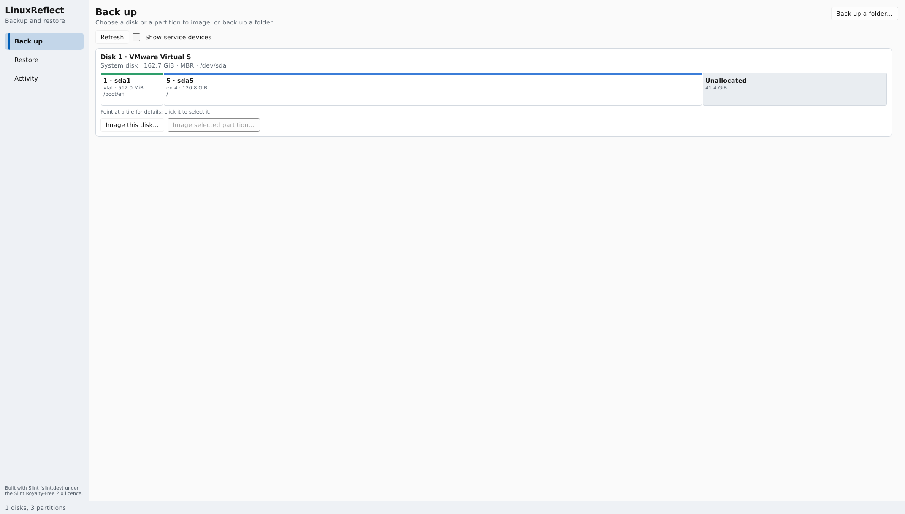

*The GUI on Ubuntu 22.04 (GNOME 42, Wayland): the system disk with its EFI
partition, the root filesystem and free space.*

## Contents

- [What it can do](#what-it-can-do)
- [A tour of the GUI](#a-tour-of-the-gui)
- [Install](#install)
- [Using the command line](#using-the-command-line)
- [Scheduled backups](#scheduled-backups)
- [Rescue medium and bare-metal recovery](#rescue-medium-and-bare-metal-recovery)
- [How it is built](#how-it-is-built)
- [Security model](#security-model)
- [Building and testing](#building-and-testing)
- [License](#license)

## What it can do

### Back up

- **Disk and partition images.** Only used blocks are read (ext4 and xfs
  bitmaps; zero-skipping for everything else), so a mostly empty disk makes
  a small image. Whole-disk images carry the partition table, the BIOS boot
  area (GRUB `core.img`) and swap headers, so the restored disk boots.
- **Folder and file backups** with content-defined chunking: permissions,
  owners, timestamps, extended attributes, ACLs, hard links, symlinks, device
  nodes and sparse files are kept. `--one-file-system` stays on one mount.
- **Btrfs streams** (`btrfs send`, with `-p` for incrementals) of subvolumes.
- **Full, incremental and differential** backups in chains; identical chunks
  are stored only once.
- **Compression** with zstd and optional **encryption**: Argon2id key
  derivation from a passphrase file, AES-256-GCM or ChaCha20-Poly1305
  authenticated encryption, keyed BLAKE3 integrity.
- **Bad sectors** either stop the job or are recorded in the image and
  reported; they are never silently filled with zeros.

### Consistency, honestly reported

Linux has no VSS. LinuxReflect uses a real point-in-time snapshot when the
system allows one (LVM and thin LVM snapshots, Btrfs read-only snapshots),
freezes the filesystem with a watchdog when you allow that, reads offline
devices directly, and only makes a live, possibly inconsistent copy when you
ask for it explicitly. The plan shown before a backup and the report after
it state the consistency **actually achieved**; it never claims a snapshot
it did not make.

### Store

- **Local folders, mounted shares** (NFS, SMB) and **SFTP**
  (`sftp://user@host/path`, SSH agent or identity file, strict host-key
  checking; passwords never go into URIs).
- A backup set is locked while a job writes to it, even over SFTP, and a
  destination that disappears mid-backup (network outage, unplugged disk)
  fails the job cleanly without damaging earlier backups.
- **Retention** keeps the newest *N* complete chains and never deletes a
  single member of a chain that others depend on.

### Restore

- A restore is **prepared** first: LinuxReflect checks the image against the
  target and shows what will be written where. The resulting token is valid
  for at most ten minutes and bound to that exact target: size, identity and
  the start of the disk.
- **Immediately before writing** the target is checked again. A disk that
  changed, is mounted, is used as swap, is part of LVM/RAID or holds the
  running system is refused.
- Disk images restore to a disk or a partition of sufficient size; file
  backups restore into an empty folder (or merge into an existing one on
  request). Restoring an incremental or differential rebuilds exactly the
  state of that backup, including files deleted before it.

### Check and browse

- **Verify** re-reads every chunk of an image or a whole chain and names
  the corrupted chunk or file if anything fails.
- **Browse without restoring:** file images mount read-only through FUSE;
  disk images are exported through NBD and mounted read-only.

### Automate

- **Schedules** from `/etc/linuxreflect/config.toml` become systemd timers,
  with retention run after each backup.
- **Desktop notifications** for started, finished and failed jobs (GNOME
  and any other `org.freedesktop.Notifications` service).
- Stopping or updating the daemon **waits for running jobs** instead of
  cutting a restore in half.

### Recover a machine that no longer boots

- A **rescue medium** (USB disk image) boots on BIOS and on UEFI with Secure
  Boot, using the distribution's signed shim and GRUB. It starts the same
  GUI, with its own daemon, and falls back to a console menu.
- **Boot repair** puts the UEFI fallback loader and NVRAM entry back, or
  reinstalls GRUB for BIOS; **layout recreation** rebuilds a partition table
  and filesystems with their original UUIDs for a file-level bare-metal
  restore.
- **Unattended restore:** the medium can restore an image to a disk from
  the kernel command line and power off.

## A tour of the GUI

The window is organised like Macrium Reflect: **Back up**, **Restore** and
**Activity** on the left, every disk with its partition map on the right.
Everything is done with the mouse; paths are typed only where a dialog cannot
reach (SFTP).

| | |
|---|---|
| 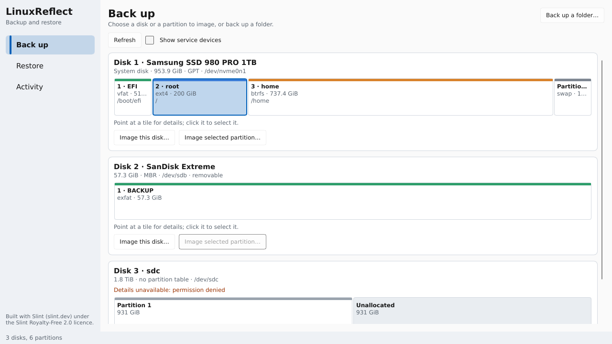 | 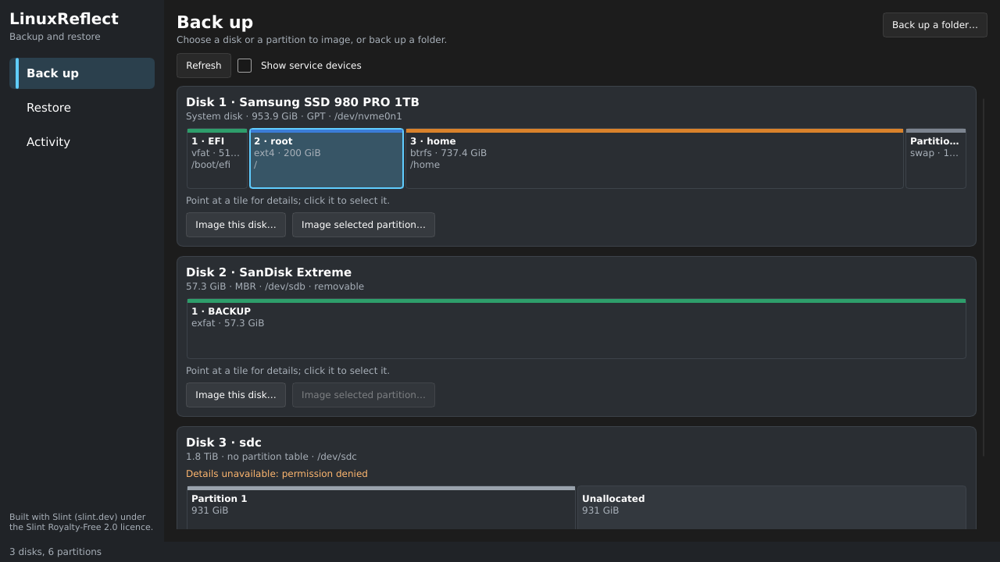 |
| **Back up.** Every disk as a panel: model, size, partition table, a proportional partition map coloured by filesystem, mount points, and "Image this disk…" / "Image selected partition…". The disk holding the running system is marked. | **Dark theme.** The GUI follows the desktop's light or dark preference. |
| 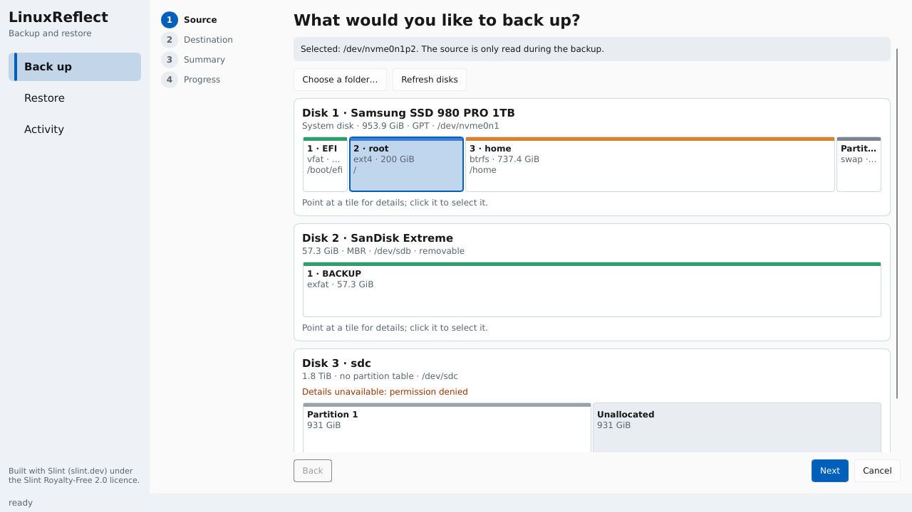 | 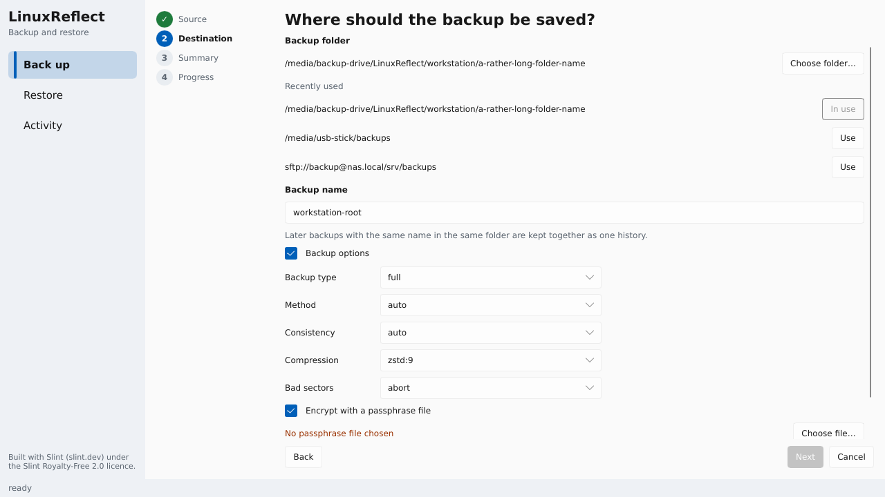 |
| **Backup wizard, step 1.** The steps are listed on the left; the source is picked on the same disk maps, or a folder is chosen with the system file dialog. | **Step 2.** A backup folder (recently used ones are one click away), a backup name, and options with safe defaults: type, method, consistency, compression, bad-sector policy, encryption. |
| 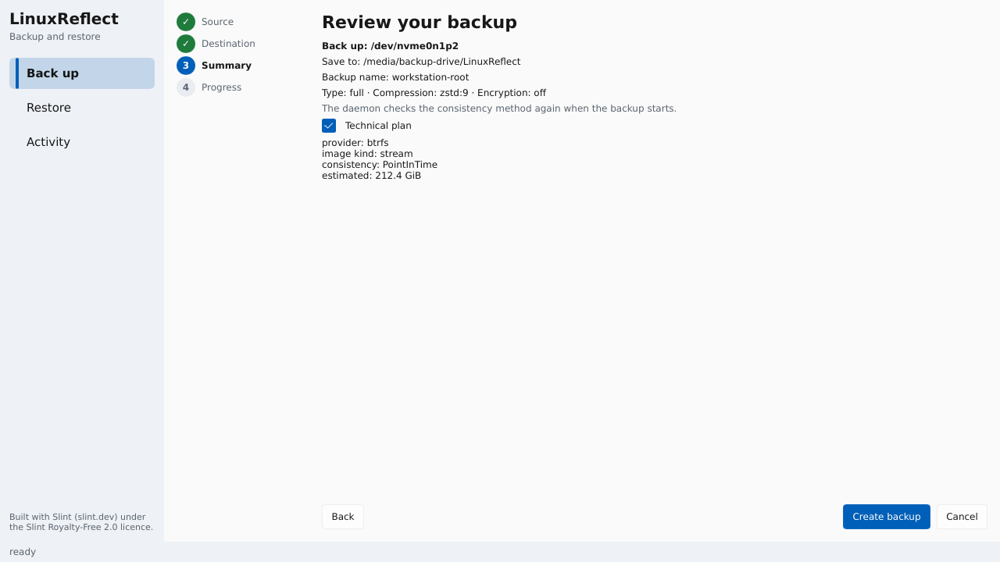 | 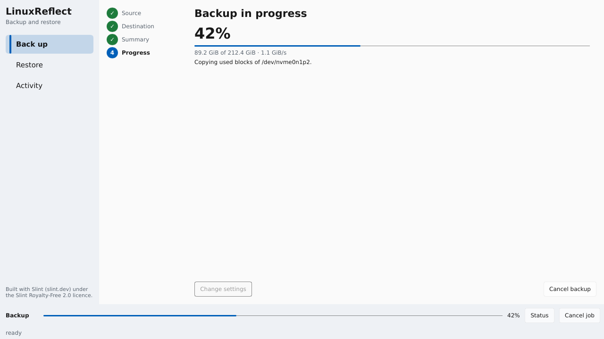 |
| **Step 3.** A plain-language summary, with the daemon's technical plan one click away. | **Progress** with percentage and throughput; the job strip at the bottom stays visible on every page, with Cancel. |
| 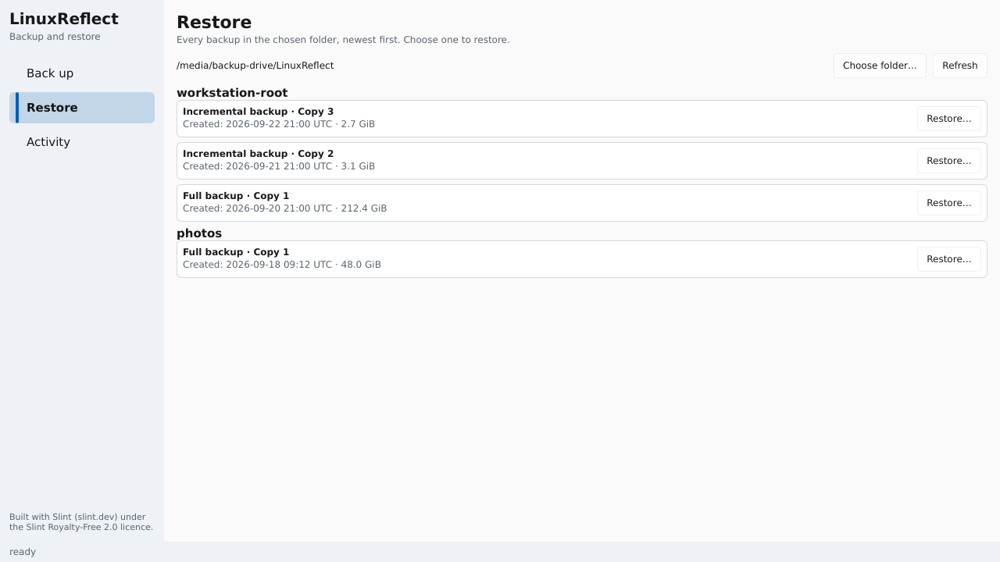 | 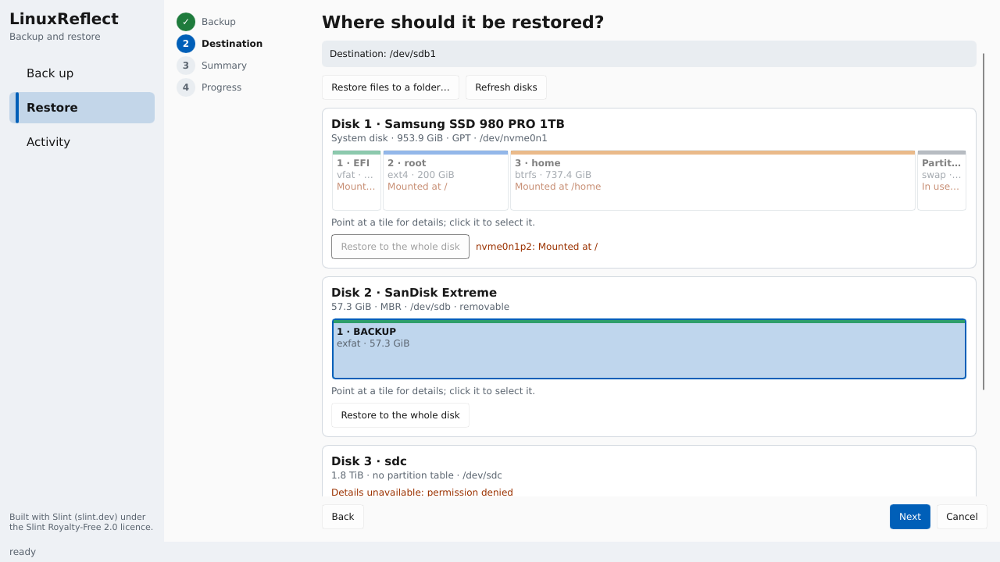 |
| **Restore library.** Every backup set in the folder, newest first, with **Restore…** and **Verify** for each copy. | **Restore destination.** Disks that cannot be written (mounted, in use, the running system) are dimmed with the reason; the rest are picked with a click. |
| 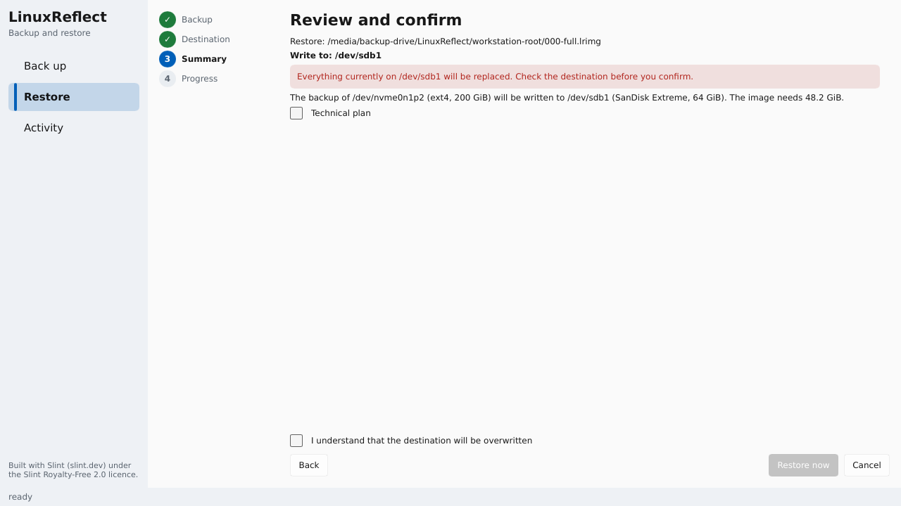 | 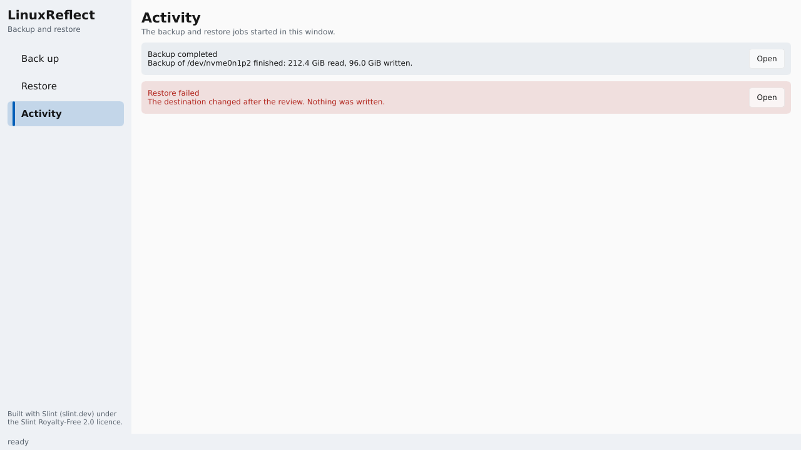 |
| **Review and confirm.** The exact target, a clear overwrite warning and an explicit confirmation; changing anything earlier invalidates the plan. | **Activity.** The jobs of this session with their results. |
| 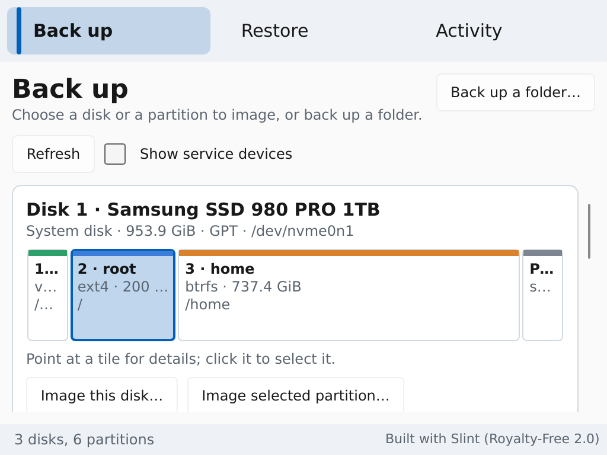 | 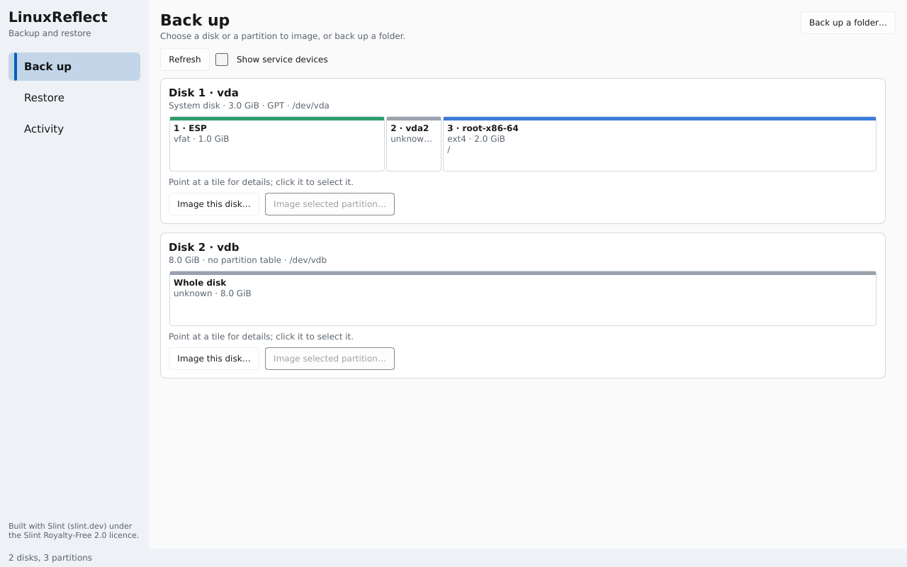 |
| **Small screens.** At 1024×768 with 200 % scaling the navigation moves to the top and the wizards drop their step list. | **Rescue medium.** The same GUI on the rescue USB, booted under UEFI Secure Boot, listing the disks of the machine. |

Most pictures above are rendered from the real UI with sample disks
(`cargo run -p lr-gui --example gallery -- DIR`, which renders every page at
1024×768, 1280×720 and 1920×1080 at 100, 150 and 200 %); the first
screenshot and the rescue one are taken from running systems.

## Install

### From the release (Ubuntu 22.04 or newer, x86_64)

Download `linuxreflect-0.1.0-alpha.1-x86_64-linux-gnu.tar.gz` from the
[releases page](https://github.com/woffko/linuxreflect/releases), check it
against `SHA256SUMS`, then:

```sh
tar xzf linuxreflect-0.1.0-alpha.1-x86_64-linux-gnu.tar.gz
cd linuxreflect-0.1.0-alpha.1
sudo BIN=$PWD/bin ./contrib/install-host.sh
sudo usermod -aG linuxreflect "$USER"     # then log out and in again
```

The installer puts the programs in `/usr/local/bin`, installs the polkit
policy, the socket-activated daemon, the per-user notifier and a menu entry.
Start **LinuxReflect** from the application menu. Viewing disks is allowed for
the active desktop session; creating a backup or restoring asks for an
administrator's password.

Updating is the same command: the running daemon finishes its jobs, exits,
and the next request starts the new version.

`linuxreflect-x86_64-linux-musl` is the command-line tool as one static
binary for any x86_64 Linux, including live and rescue systems.

### From source

Rust 1.95 (pinned in `rust-toolchain.toml`), `protoc`, `pkg-config` and the
fontconfig headers are needed:

```sh
sudo apt install protobuf-compiler pkg-config libfontconfig-dev
cargo build --release -p lr-cli -p lr-daemon -p lr-gui -p lr-session -p lr-rescue
sudo ./contrib/install-host.sh
```

## Using the command line

Every command talks to the daemon when it runs and works in-process (as root)
when it does not. `--json` gives machine-readable output everywhere.

```sh
# Look around.
linuxreflect disk list
linuxreflect disk map /dev/nvme0n1
linuxreflect caps                       # what this machine supports (LVM, Btrfs, NBD, polkit…)

# What would a backup do, and how consistent would it be?
linuxreflect probe --source /dev/vg0/root

# Back up a partition, a whole disk or a folder.
linuxreflect backup create --source /dev/vg0/root --dest /mnt/backup --set laptop-root
linuxreflect backup create --source /dev/nvme0n1 --dest /mnt/backup --set laptop-disk
linuxreflect backup create --source /home --dest sftp://backup@nas/backups --set home \
    --type incremental --parent latest --passphrase-file /etc/linuxreflect/home.key

# A point-in-time copy of a Btrfs root, staying on that filesystem.
linuxreflect backup create --source / --dest /mnt/backup --set root --mode file \
    --snapshot btrfs --one-file-system

# What is in a destination?
linuxreflect backup list --dest /mnt/backup --set laptop-root
linuxreflect verify --image /mnt/backup/laptop-root/<chain>/000-full-<uuid>.lrimg --chain

# Restore: prepare (shows the plan and a token), then apply.
linuxreflect restore prepare --image /mnt/backup/laptop-root/<chain>/000-full-<uuid>.lrimg \
    --target /dev/sdb2
linuxreflect restore apply --token <token> --confirm

# Browse an image without restoring it.
linuxreflect restore mount --image <file image> --at /mnt/view     # FUSE, file images
linuxreflect export mount --image <disk image> --at /mnt/export    # NBD, disk images
linuxreflect export umount --at /mnt/export

# Jobs and housekeeping.
linuxreflect job get <job-id>
linuxreflect job cancel <job-id>
linuxreflect retention apply --dest /mnt/backup --set laptop-root --keep-chains 2 --dry-run
linuxreflect catalog --dest /mnt/backup --set laptop-root          # rebuild the catalog
```

Useful `backup create` options: `--type full|incremental|differential`,
`--mode auto|block|stream|file`, `--snapshot auto|lvm|btrfs|freeze|offline|none`
(`freeze` needs `--allow-freeze`, `none` needs `--allow-inconsistent`),
`--compress zstd:9|none`, `--passphrase-file` or `--no-encrypt`,
`--on-bad-sector abort|record`, `--max-incrementals N`.

## Scheduled backups

Jobs live in `/etc/linuxreflect/config.toml`:

```toml
[[job]]
name = "root-nightly"
source = ["/dev/vg0/root"]
dest = "sftp://backup@nas.local/backups/laptop"
set = "laptop-root"
type = "incremental"
parent = "latest"
snapshot = "auto"
compress = "zstd:9"
encrypt = true
passphrase_file = "/etc/linuxreflect/laptop-root.key"
on_calendar = "*-*-* 02:00:00"
randomized_delay = "15m"
persistent = true

[job.retention]
keep_chains = 2
max_incrementals_per_chain = 14
new_chain_on_calendar = "Sun *-*-* 02:00:00"
```

```sh
sudo linuxreflect schedule set --config /etc/linuxreflect/config.toml
linuxreflect schedule list --config /etc/linuxreflect/config.toml
sudo linuxreflect schedule remove root-nightly
```

`schedule set` writes `linuxreflect-job@<name>.service` and `.timer` and
enables them. Each user's `linuxreflect-session` service turns job events into
desktop notifications (failures are critical and carry the error code).

## Rescue medium and bare-metal recovery

Write `linuxreflect-rescue-0.1.0-alpha.1.img.zst` from the release to a USB
stick (this erases the stick):

```sh
zstd -dc linuxreflect-rescue-0.1.0-alpha.1.img.zst | sudo dd of=/dev/sdX bs=4M conv=fsync
```

It boots on BIOS and on UEFI with Secure Boot, starts the GUI (with its own
daemon) on the screen and falls back to a console menu. From there, or from
any live system with the static CLI:

```sh
# Restore a whole-disk image to a new disk.
linuxreflect restore prepare --image /mnt/usb/laptop-disk/<chain>/000-full-<uuid>.lrimg --target /dev/nvme0n1
linuxreflect restore apply --token <token> --confirm

# Make it boot again (preview first; --confirm writes).
linuxreflect-rescue boot-repair --dry-run --disk /dev/nvme0n1 --firmware uefi --esp-partition 1
linuxreflect-rescue boot-repair --confirm --disk /dev/nvme0n1 --firmware uefi --esp-partition 1

# For a file-level restore: rebuild the partitions and filesystems with their UUIDs.
linuxreflect-rescue recreate-layout --confirm --disk /dev/sda --dump /backups/sda.sfdisk \
    --filesystem 1:vfat:1234-ABCD:ESP \
    --filesystem 2:ext4:0f1e2d3c-4b5a-6978-8796-a5b4c3d2e1f0:ROOT
```

On the medium the repair tool is called `linuxreflect-repair`. Without
`--confirm` the repair commands only print their plan; layout recreation also
refuses a disk that is mounted or changed since the plan. The medium can run
a restore unattended from the kernel command line
(`linuxreflect.autorun=1 linuxreflect.image=… linuxreflect.target=…`) and
power off. `contrib/rescue/build-mkosi.sh` builds the medium (mkosi, Ubuntu
24.04 packages).

## How it is built

A root daemon does every privileged operation; clients never open a device.

```
 linuxreflect-gui ─────┐
 linuxreflect (CLI) ───┼── gRPC over /run/linuxreflect/daemon.sock ──▶ linuxreflect-daemon ──▶ disks, snapshots,
 linuxreflect-session ─┘          (polkit authorisation per action)                          destinations
```

| Crate | Purpose |
|---|---|
| `lr-core` | errors, IDs, geometry, consistency levels, capability probe, disk discovery |
| `lr-unsafe` | every `unsafe` block (block ioctls, `pidfd_open`, file metadata) |
| `lr-crypto` | key hierarchy, AEAD, keyed BLAKE3, nonce counters |
| `lr-format` | the `.lrimg` format: superblock, pages, chunk records, manifests ([spec](docs/format-lrimg-v1.md)) |
| `lr-fsmap` | used-block maps for ext4 and xfs, zero-skipping for the rest |
| `lr-snapshot` | LVM, thin LVM, Btrfs, freeze, offline and live providers |
| `lr-blocksource` | aligned direct reads from block devices |
| `lr-store` | destinations (local, mounted, SFTP) and set locking |
| `lr-engine` | backup, restore, verify, chains, catalog, retention, schedules |
| `lr-export` | NBD export of disk images |
| `lr-fuse` | read-only FUSE view of file images |
| `lr-proto` | the gRPC API |
| `lr-daemon` | the daemon: polkit, jobs, restore tokens, socket activation |
| `lr-cli` | `linuxreflect` |
| `lr-gui` | `linuxreflect-gui` (Slint) |
| `lr-session` | `linuxreflect-session`, the desktop notifier |
| `lr-rescue` | boot repair, layout recreation, rescue media |

Every crate except `lr-unsafe` is `#![forbid(unsafe_code)]`.

## Security model

- **Sources are opened read-only.** Nothing in a backup path writes to a
  source device.
- **Writes need four things:** a restore token for that exact target, an
  explicit confirmation, polkit `auth_admin` (asked every time), and target
  facts that still match immediately before writing.
- **polkit actions** (`org.linuxreflect.*`): reading disk information is
  allowed for the active local session; creating backups, preparing
  restores, managing snapshots, schedules, destinations and exports need an
  administrator. The daemon identifies callers by `SO_PEERCRED` and a pidfd.
- **Secrets** are read from passphrase files (opened without following
  symlinks, permission-checked, zeroised) and never appear in arguments,
  logs or URIs.
- **Consistency is never overstated.**

## Building and testing

```sh
cargo xtask ci          # rustfmt, clippy -D warnings, tests, cargo deny, cargo audit
cargo test --workspace  # unprivileged tests
```

Tests that need root, loop devices, LVM, `dm-flakey`, NFS/SMB, NBD, qemu or a
display are `#[ignore]`d and run with:

```sh
LR_ROOT_TESTS=1 sudo -E cargo test --workspace -- --ignored --nocapture --test-threads=1
```

They create and use only their own loop devices, images and VMs. They cover,
among others: round trips on ext4, xfs, btrfs, FAT32 and NTFS; whole-disk
restores that boot under SeaBIOS and OVMF; a 16 TB virtual disk backed up in
under 30 MiB of memory; bad sectors via `dm-flakey`; NFS and SMB shares that
vanish mid-backup; polkit and socket activation; the rescue medium under
Secure Boot; and create/restore/verify through the GUI on X11 and Wayland.

More detail: the [specification](docs/spec/linuxreflect-spec-v2.1.md), the
[decision log](docs/decisions.md), the [GUI design](docs/gui-redesign.md) and
the [verification record](docs/gui-revision-audit.md).

## License

LinuxReflect is licensed under either of the [MIT license](LICENSE-MIT) or the
[Apache License, Version 2.0](LICENSE-APACHE), at your option. The GUI uses
[Slint](https://slint.dev) under the Slint Royalty-Free 2.0 licence; the
attribution it asks for is shown in the window and here. Unless you state
otherwise, any contribution you submit is licensed as above, without
additional terms.
